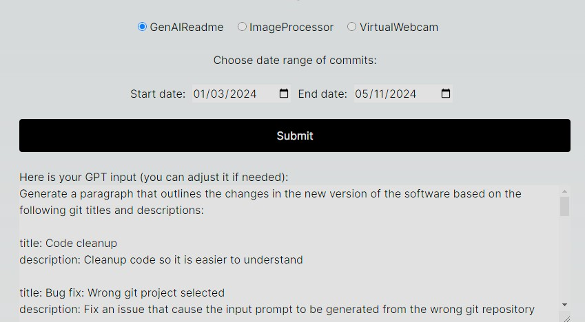
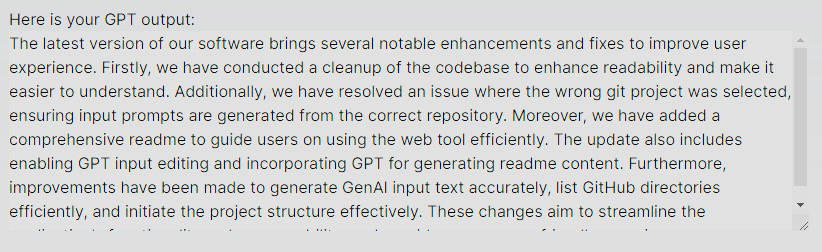

# GenAIReadme

## 1 - Overview
GenAIReadme is a web tool that allows the user to select a range of git commits and generate a personalized readme that summarizes the changes.

The server will have a known directory where all the git projects are located and will generate a list projects to choose from. 

The user selects a project, a date range of commits and the server will generate the input text. The input text can be modified by the user if needed. This is the prompt for the OpenAI model. 

Once the user is satisfied with the prompt, the readme can be generated. Under the hood, the server calls the Chat GPT 3.5-turbo model to process the input prompt.

## 2 - Setup
### 2.1 - Environnement variables
Before running the tool, environnement variables need to be setup. This step is OS specific, so you will need to search on how to create environnement variable for your system.

There are 2 variables to be created : 
1. GENAI_README_GIT_PROJECT_DIRECTORY: The directory on the server that contains the git projects. Note: It is important that the folders are only git projects. There are no error checking in this tool and you might encounter unexpected behaviours if a non git project is present in the specified directory. 

2. GENAI_README_OPENAI_SECRET_KEY: This is the OpenAI API key that will enalbe access to the gpt model. Visit OpenAI's website to generate your unique key. If you do not specify this variable, you can stil use this tool without the generate function. Note: This tool does not store your API key and only accesses it throught the environnement variable.

For example, if your projects are in the folder C:\Users\username\Documents\GitHub\ and your secret key is: 123-abc, you environnement variables would be:

name: GENAI_README_GIT_PROJECT_DIRECTORY
value: C:\Users\username\Documents\GitHub\

name: GENAI_README_OPENAI_SECRET_KEY
value: 123-abc

### 2.2 - Project setup
The node.js packages dependencies are specified in the package.json. 

To run in dev mode, use :
> npm run dev

You can then access the tool from localhost:3000

To build and deploy for production use:
> npm run build

> npm run start

The production will be deployed to localhost port 80 automatically. 

## 3. Example
If you have the current repository (GenAIReadme) with the commit selected between 03/31/2024 and 05/01/2024, you will get a similar prompt generated by the server:

And you might obtain the following output from the gpt model:

You can modify the input prompt to tweak the model (for example: write 2 paragraphs instead of 1, change the tone, etc.)